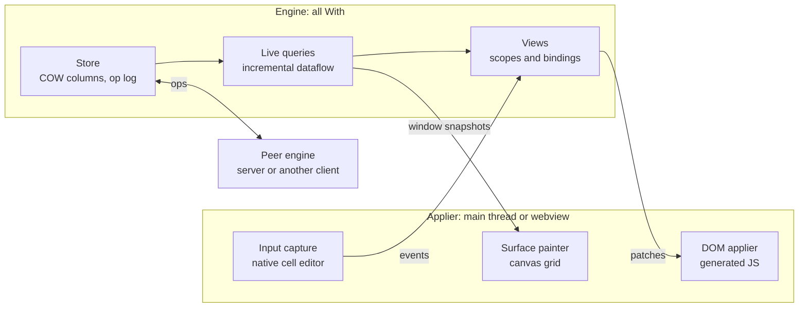

# With UI: big-picture architecture proposal

This feature is highly dependent on docs/feature_plans/from-query-expressions.md - it cannot be implemented until `from` is done.

## Summary

With UI is a full-stack application framework written in With, where client, server, queries and schema are one program that one compiler sees whole. "With UI" is a placeholder name.

A web app today is five programs pretending to be one: browser UI, API server, database schema, build pipeline and deploy config. Every seam between them is maintained by hand, and most popular tools of the last five years patch exactly one seam. With owns the compiler, the runtime, the query language and both build targets, so it can remove the seams instead of patching them.

The design rests on four ideas:

- **The UI is a live query.** Views are built from `from` expressions over live data. The engine maintains results incrementally and emits row-level deltas, which become UI patches. There is no virtual DOM and no cache to invalidate.
- **State is an owned value tree.** Ownership means application state has no cycles or aliases, so it can be snapshotted, serialized, migrated, synced and replayed.
- **One patch protocol, many homes.** The engine emits a byte stream of patches. It can run in a browser worker, on a server, or natively inside a desktop or mobile shell. The rendering side cannot tell the difference.
- **Every layer stands alone.** The data engine, the components and the full framework are each usable without the others, and each has an escape hatch.

The north-star application is a Smartsheet-class product: a million-row sheet that opens instantly, scrolls at 60 fps, recalculates formulas live, syncs between users in real time and keeps working offline.

## Goals, non-goals and v0.1 decisions

The goal is a framework that is Rails-simple at the bottom and Figma-capable at the top, with no rewrite between them.

**Goals**

- With through and through: application logic, engine and server are With. JavaScript exists only as generated glue.
- One codebase for browser, server, desktop and mobile.
- Local-first by default: reads are local, writes are instant, sync runs in the background, offline works.
- Structural performance: application logic never runs on the browser main thread.
- Incremental adoption from existing JavaScript applications.
- Deterministic execution, so any session can be recorded and replayed.

**Non-goals**

- A new rendering engine. The platform's DOM and canvas do the drawing.
- HTML syntax in the With grammar, token macros, or storable references.
- An ORM, or a new query language beyond `from`.
- Native look and feel per platform in v0.1.

**Decisions already made**

| Decision | Choice | Why |
| --- | --- | --- |
| Look and feel in v0.1 | Identical on every platform | One design system to build and test. Native styling comes later as themes. |
| Rendering model | Run-once views with fine-grained bindings | Re-render and diff costs O(view size). Here the view spans a million rows and a change touches one cell. |
| Where the engine runs | Off the main thread, always | Jank becomes impossible to introduce by accident. |
| Desktop and mobile shells | System webview, native engine | Small binaries. The webview only applies patches, which limits cross-platform bugs. |
| Interop boundary | Custom elements | One surface covers Angular, React, Svelte and Vue. |
| Compiler knowledge of UI | None | The compiler knows queries, builder blocks and threads. The framework is a library. |

## Lineage

Each predecessor proved one idea and hit one wall. With UI takes the idea and is designed around the wall.

| Predecessor | What we take | The wall it hit | How With UI avoids it |
| --- | --- | --- | --- |
| Blazor | One language on both sides. Placement chosen per component: static, server-driven, client. | Ships a managed runtime to the browser, so startup and size suffer. Auto mode only switches placement on a later visit. | No GC and no libc, so payloads are kilobytes. State is a value tree, so a live session can move between placements. |
| Flutter | One codebase for every platform. Excellent tooling and hot reload. | Draws everything itself, so web is second-class and text input, scrolling and accessibility are a permanent chase. | Web is the first-class target. Shells wrap it, so the platform supplies input, scrolling and accessibility. |
| Meteor | No API layer, live queries, optimistic UI. | Magic without escape hatches, welded to one database, live queries that did not scale, all-or-nothing adoption. | Every layer usable alone, boring storage underneath, escape hatches at every level, tooling that explains the dataflow. |
| Tauri | System webview plus native backend gives small apps. | Webview differences across platforms leak into application code. | The engine is native, so the webview only applies patches and paints a canvas. |
| Svelte and Solid | The compiler or runtime tracks dependencies. No virtual DOM. | Reactivity stops at the component. Data fetching and sync are someone else's problem. | Reactivity starts at the store and runs through queries to the pixels. |
| Local-first sync engines | A real database on the client and sync instead of fetch. | Bolted onto UI frameworks that were not designed for them. | The sync engine and the rendering engine are the same incremental dataflow. |

LINQ's own lineage matters here too. Rx grew out of the same work, on the insight that an observable is the dual of an enumerable. A `from` expression over a live source is that idea applied to UI.

## Developer experience

The framework is data-first: a developer works with stores, live queries and views, and components are thin.

In a document-centric app nearly all state is the document. Component-local state is small: a hover, an open menu, an edit buffer. So the three nouns are:

- **Store**: owned, typed, live data. Derives its schema, serialization and operations from a struct.
- **Live query**: a `from` expression over a store. It is maintained, not re-run.
- **View**: a function from live values to UI, written with builder blocks.

You write a view as if it runs once, and it behaves like a dataflow graph. A `for` over a live query is the list primitive. An `if` on a live value is the conditional.

All syntax below is a sketch and assumes the builder-block feature described later.

```
@[derive(Store)]
struct Task:
    id: TaskId
    title: str
    status: Status
    rank: f64
    archived: bool = false

fn board(sheet: Live[Sheet]):
    let lanes = from sheet.tasks | where !archived | group by status
    row(gap: 12):
        for lane in lanes:
            column(key: lane.key):
                text(lane.key.label())
                for task in lane | order by rank:
                    card(key: task.id, on_drop: s => s.move_task(task.id, lane.key)):
                        text(task.title)
```

**The `with` block is the transaction.** Every document write happens inside `with sheet.tx() as mut s:`. That one scope boundary is the undo step, the sync message, the render batch and the automation trigger. The language's namesake feature becomes the framework's central ritual.

```
fn rename(sheet: Live[Sheet], id: TaskId, title: str):
    with sheet.tx("Rename task") as mut s:
        s.tasks[id].title = title
```

**Handlers take state as a parameter, not a capture.** Section 12 of the spec forbids an escaping closure from capturing `self`. The framework owns the state and passes it in at dispatch, so `s => s.move_task(...)` captures only `Copy` values and is legal today.

**Lists are windowed by default.** A list takes a query and a visible window. Scrolling moves the window. Nobody renders a million rows.

**Surfaces are peers.** A canvas grid and a DOM toolbar are both views over live values, with no seam visible to the developer.

**One tool.** `with run` is the compiler, dev server, test runner and formatter. There is no bundler, no package manifest for JavaScript and no configuration file to get wrong.

## Runtime architecture

The system is two halves joined by a byte stream: an engine that owns all state and logic, and an applier that only draws and forwards input.



Patches and window snapshots flow out of the engine. Events flow in. Operations flow between engines.

**The engine** holds the store, the dataflow graph, the view scopes and the fiber scheduler. It is identical on every target, because it is ordinary With code compiled natively or to wasm.

**The applier** is deliberately thin. It applies DOM patches, paints canvas surfaces from window snapshots, and forwards input. In the browser the compiler generates it per application, so it contains only the glue that application uses.

**The transport** is the only thing that differs between targets.

| Target | Engine runs | Transport to the applier |
| --- | --- | --- |
| Browser | wasm, in a worker | Shared memory ring buffers, or `postMessage` |
| Server-driven | Native, on the server | WebSocket |
| Desktop and mobile | Native, in the shell process | Webview IPC |
| Static page | At compile time | None: HTML is emitted, zero wasm ships |

Two consequences follow. Placement becomes a transport choice, so Blazor-style render modes are not a feature to build. And a running session can move: ship a snapshot to a second engine, then switch which engine feeds the stream.

**Typing stays instant** because the active cell editor is a native DOM input owned by the applier. Only the commit crosses to the engine.

**Painter input is a serializable window snapshot**: the visible 60 rows by 20 columns. In the browser, shared memory makes this zero-copy. Across IPC or a socket it is a small message. Defining it this way keeps all four targets on one code path.

## The engine

The engine is an incremental dataflow system over a columnar store, and it is the spine of the whole project.

**Store.** Typed columns held in chunks that are copy-on-write. This one structure pays for itself five times:

- A reader on another thread gets a consistent snapshot while the engine writes.
- Undo and version history keep old chunks instead of copying data.
- Sync diffs compare chunk identities before comparing contents.
- Hot reload hands state to a new module as a snapshot.
- Session handoff between placements ships the same snapshot.

**Op log.** Every transaction appends typed operations. The log is the source for undo, history, audit, sync and replay. Operations are generated by derive from field writes inside a `with` transaction, so developers do not write them by hand.

**Live queries.** A `from` expression lowers to a query plan value. The plan is instantiated as a graph of operators: filter, map, sort, group, join, aggregate, window. Changes enter as row-level deltas, are batched per transaction, and propagate in dependency order, so nothing observes a half-updated state.

**Windowing.** Sorted views use an order-statistic structure such as a counted B-tree. "Rows k to k+60" and "this row moved from i to j" are both logarithmic.

**Formulas.** Spreadsheet recalculation is incremental computation over a dependency graph, so it is the same machine. Column formulas run as vectorized kernels over column chunks, with wasm SIMD where available. Sparse per-cell formulas are graph nodes.

**Graph ownership.** Operators point at each other with dynamic lifetimes. They live in generational arenas and refer to each other by handle (spec section 6). This layer is a showcase for handles.

**Plans are values.** This is a requested change to the `from` feature plan, which currently lowers SQL queries to a string. If `from` lowers to a first-class plan value instead:

- A developer's compile-time query and an end user's runtime-built filter are the same type, fed to the same engine.
- The UI for building a filter or report is an editor for that value.
- Compile-time plans can be specialized into fused kernels. Runtime plans interpret the same operators.
- Plans are safe targets for natural-language query building, because permissions are enforced beneath them.

**SQLite's role.** SQLite is the durable format and the unit of backup. It is not the live engine, because it does not maintain results incrementally. The cost is a second query executor, which the plan-value design keeps small by sharing one operator set.

## View layer and rendering

A view runs once to build structure and create one binding per dynamic hole. After that, only deltas move.

**Scopes.** Each component instance, list row and conditional branch is a scope. A scope owns an arena, a fiber scope and its subscriptions. When a scope ends, the arena is freed and its fibers are cancelled. Updates after unmount, leaked subscriptions and orphaned requests become bugs nobody can write.

**Lists.** `for` over a live query creates one child scope per row in the window. Insert, remove and move deltas from the query create, destroy and reorder scopes directly. There is no keyed diff, because the query engine already knows what changed.

**Static and dynamic split.** The compiler or the builder separates a view's fixed skeleton from its holes. The skeleton ships once as a template and is cloned. Only holes are patched. A view with no dynamic inputs is evaluated at compile time to plain HTML.

**Patch format.** A compact binary list of operations: create from template, set text, set attribute, set property with a structured value, insert, move, remove, attach listener. One call per frame carries the whole batch. "Set property" with structured values exists for web components, which take rich data as properties.

**Surfaces.** A surface is a view that draws to a canvas instead of emitting elements. The grid is the first. A surface must implement the accessibility-tree trait, which maintains a parallel ARIA structure for screen readers. Enterprise buyers will check this.

**Async handlers and exclusivity.** A handler fiber holds a handle to its state, not a borrow. It takes access through scoped `with` blocks, and the compiler rejects a `with` scope that spans a suspension point. State is re-acquired after each await, which forces the author to handle "the component went away while I waited".

**One look everywhere in v0.1.** The framework ships one design system, drawn identically on every platform.

- Design tokens are CSS custom properties. DOM components and canvas surfaces read the same tokens, so the grid matches the toolbar.
- Components are distributed shadcn-style: a registry of With source that a CLI copies into the project, so teams own and edit them.
- Behaviour leans on the platform where it has caught up: `dialog`, the Popover API and CSS anchor positioning. A small headless layer in With covers what remains, mainly focus trapping, roving tabindex and typeahead.
- Tailwind-style class strings work unchanged in light DOM, because DOM is DOM.
- Native look and feel arrives later as alternative token sets and component variants, not as a second renderer.

**Accessibility as type errors.** `img` without `alt:` does not compile, because it is a required named argument. Form controls require a label association. Not everything can be caught this way, but the floor moves from "audit later" to "cannot ship".

## Sync, permissions and the server

There is no API layer: engines exchange operations, and the server is the same engine compiled natively.

**Sync model.** Each client holds a replica of the data it may see. A local transaction applies immediately and its ops queue for the server. The server assigns the authoritative order and broadcasts. A client rebases pending ops over what arrives. A rejected op rolls back locally with a typed reason.

**Conflict rules.** A cell is a last-writer-wins register, so most of a sheet needs nothing more. Row order uses fractional indexing. The indent hierarchy needs a tree-move rule that cannot create cycles. These three cover the north-star app.

**What this removes.** No fetch calls, so no per-call loading and error states. No cache, so no invalidation. Optimistic updates stop being a technique and become what a local write is.

**Permissions are queries, enforced once.** Row and column policies are written as `from` predicates beside the schema. They compile into the sync layer, so a replica never receives a row its user may not see. Client code cannot ask for more, because no such code path exists. The same policies gate writes on the server.

**Compile-time query allowlist.** Every developer-written remote query is known at build time. The server accepts that set and nothing else. Runtime-built plans from end users are validated against the schema and run beneath the same policies.

**Validation lives on the type.** Constraints declared on a field are used by the form, the store, the server and the schema. A form can be derived from a type and then customized.

**Schema evolution is one mechanism.** Three problems are the same problem: hot reload that keeps state, yesterday's tab talking to today's server, and migrating data held in a browser replica. Types are versioned, a missing migration is a compile error, and ops carry their schema version so the server can translate.

**Automations** are live queries with effects, running on the server: "when a row matching X changes, do Y". Same language, same engine.

**Escape hatches.** Plain HTTP endpoints for webhooks and integrations. Raw SQL against the durable store. Any layer can be bypassed without leaving the framework.

## Targets and shells

One view layer, one engine and one patch protocol run in six shells.

| Shell | Engine | Applier | Storage | Notes |
| --- | --- | --- | --- | --- |
| Browser | wasm in a worker | Generated JS on the main thread | Browser storage (OPFS) | The reference target. |
| Server-driven | Native on the server | Same generated JS | Server SQLite | No wasm download. Suits CRUD apps and first paint. |
| Desktop | Native in the shell process | System webview | SQLite on disk | Real threads, no wasm memory ceiling. Faster than the browser build. |
| Mobile | Native in the app process | WKWebView or Android WebView | SQLite on device | Platform supplies IME, scroll physics and accessibility. |
| PWA | Same as browser | Same as browser | Browser storage | Costs nothing extra. iOS limits storage and push. |
| Static | Compile time | None | None | Plain HTML, zero wasm. |

**System webview, not bundled Chromium.** Electron's size and memory use are its reputation. With UI asks very little of the webview, because the engine is native: no threads, shared memory or JSPI are needed inside it. A bundled-Chromium mode can exist later for teams that need pixel consistency.

**Every install is a node.** On desktop the app is a server and a client in one process. The same binary opens a window by default or runs as `myapp serve`. A small team can use one person's desktop build as the hub, then move to a server by copying a file. Desktop, server, self-hosted and offline become one artifact with a flag.

**Capabilities generate the manifests.** Platform features such as camera, notifications, location and files are capability values. The compiler knows statically which ones a program requests. It generates iOS usage descriptions and Android permissions, and refuses to build when code reaches for an undeclared capability.

**Shell projects are generated.** Xcode and Gradle projects are emitted by the tool and never hand-edited. `with doctor` checks the host for signing identities, SDKs and device support. Signing and store packaging remain unavoidable work.

**No custom renderer.** A native applier without a webview stays possible, because the applier interface is small. It is not planned. Dioxus's Blitz renderer reuses Firefox's style engine and is still marked pre-alpha, which is a fair measure of that road. [source](https://github.com/DioxusLabs/blitz)

## Interop: web components and JS frameworks

Custom elements are the C ABI of the UI world, and With UI treats them the way With treats `c_import` and `@[c_export]`.

Angular, Vue and Svelte both consume and export custom elements. React 19 passes every test on Custom Elements Everywhere and sets rich data as properties. So interop with all of them reduces to one question: how well does With import and export custom elements? [source](https://custom-elements-everywhere.com/)

**Exporting.** `@[custom_element("with-sheet")]` on a component makes the generated host register an element class. Lifecycle callbacks, attribute changes and property sets forward into the engine. An exported element is one more root for the patch stream.

From the same definition the compiler also emits the Custom Elements Manifest, TypeScript declarations and thin typed wrappers for React and others. Exported elements can participate in forms and can be server-rendered with declarative shadow DOM, which a natively compiled server does without Node. Shadow or light DOM is chosen per component, since Tailwind does not pierce shadow roots.

**Importing.** A library's Custom Elements Manifest is read as a tracked comptime input and turned into typed bindings. A third-party element becomes a checked call with named arguments and typed events. This is `c_import` for UI.

**Three tiers of adoption.** Nobody rewrites a working app in a new language, so each tier must be useful alone.

| Tier | What a team adopts | What they keep |
| --- | --- | --- |
| 1. Engine only | Store, live queries and sync, with adapters: a React hook, a Svelte store, a Vue ref, an Angular signal | Their whole UI |
| 2. Drop-in elements | `<with-sheet>`, `<with-gantt>` inside their app | Their framework and routing |
| 3. Full With app | Everything, with foreign islands for JS widgets they still need | Selected JS components |

**Foreign islands.** A view reserves a DOM node that the patcher never touches, hands it to a JavaScript mount function, and ties unmount to the scope's lifetime.

**Limits, stated plainly.** Interop works for leaves and whole islands. It works badly for interleaved trees. Framework context, dependency injection, portals and focus management do not cross boundaries. Rich props are copied across the wasm edge. Two runtimes ship.

**The synchronous API problem.** `el.value` must return immediately, but the engine lives in a worker. The applier keeps a synchronously readable mirror of public properties, and methods that do work return promises.

**Internally, components are not custom elements.** A million shadow roots, canvas surfaces and a worker-resident engine all fight that model. Custom elements appear at export boundaries only, as in Svelte, Vue and Stencil.

## Time and determinism

The engine is deterministic, so any session can be recorded and replayed exactly. This is the feature no other stack can copy.

**Why With can guarantee it.** The capability model already says that authority enters a program only through unforgeable values. Extend that to runtime: clock, randomness, network and storage arrive as capabilities. Values can be recorded and substituted, so every source of nondeterminism has a tap.

**What falls out of an op log plus determinism:**

- **Undo and redo**, per transaction, with the label given to `tx()`.
- **Cell history, version history and audit log.** These are product features Smartsheet sells. Here they are views over the log.
- **Replayable bug reports.** The user clicks "report". The developer receives a snapshot and an op log, and watches the exact session. "Cannot reproduce" stops being a category.
- **Time-travel debugging** in development, using the same mechanism.
- **Hot reload that keeps state**, because state is a snapshot and the schema machinery migrates it.

**Simulation testing.** Several engines, a simulated network that drops and reorders, and a virtual clock run in one native process. A seed reproduces any failure. Three users editing the same sheet over a bad connection becomes a unit test that runs in milliseconds. This is the approach TigerBeetle and FoundationDB use for databases, applied to a UI application.

**Tests without a browser.** Views are functions over live values, and their output is a patch stream that can be asserted on. Most UI tests run natively. A browser is needed only to test the applier itself.

**Explainable reactivity.** `with analyze` should answer "why did this cell update" by printing the dataflow path from the op to the patch. Meteor lost developers when its magic could not be inspected. Legibility is a launch requirement, not a later nicety.

**Suited to agent-written code.** Seam bugs are compile errors, tests run in milliseconds, and any failure replays from a seed. That is an environment where coding agents can iterate without drifting.

## Language and compiler work

Nothing on this list is UI-specific. The compiler learns about queries, builder blocks, threads and targets, and the framework stays a library.

"Today" describes `main` at commit `caae06d`, per `docs/wasm-target.md` and the spec.

| Work item | Why the framework needs it | Today |
| --- | --- | --- |
| wasm reactor mode | A UI initializes, returns to the host and is called back per event | Command model only: `_start` runs `main`, then `proc_exit` |
| First-class wasm exports | The host calls into With for events and lifecycle | None. `link_args` can pass `--export` by hand |
| Extensible generated host | Application imports beyond WASI, generated per program | Host wires `wasi_snapshot_preview1` only |
| wasm threads, shared memory, atomics | Engine off the main thread, zero-copy painter | `rt_thread_spawn` reports failure on wasm. The allocator in `rt/wasm.w` is single-threaded |
| Fibers on wasm through JSPI | `async` in handlers, fetch and timers without callbacks | wasm links `fiber_stubs.o` and the link refuses async programs |
| Builder blocks | Markup-like views as ordinary checked code, consistent with "no macros" | Not in the language. Named arguments exist (spec 9.1a) |
| `from` lowering to a plan value, with live sources | One engine for compile-time and runtime queries | Planned feature. SQL currently lowers to a string |
| Typed rows from a schema | Views need field access, not `row.str("name")` | Rows are dynamic in the plan. Tracked-input comptime can read a schema |
| Derive for stores, ops, serialization and migrations | Op log, sync and snapshots without hand-written code | Derive exists (spec 11.8, 17.3). These derives do not |
| Versioned types with required migrations | One mechanism for hot reload, version skew and replica upgrade | New |
| No `with` scope across a suspension point | Sound async handlers over shared state | To be specified |
| Runtime capabilities | Determinism, record and replay, generated permission manifests | Capabilities exist for comptime only (spec 17.1b) |
| `js_import` from WebIDL and Custom Elements Manifests | Typed DOM and web component bindings | New. Mirrors `c_import` |
| wasm SIMD | Vectorized column kernels | To be checked |
| `std.regex` and `std.zlib` for wasm32 | Routing and compression in the client | Host objects only. Programs using them fail at the wasm link |
| iOS and Android targets | Mobile shells | New targets. iOS goes through libSystem like Darwin. Android filters some syscalls |
| Effect summaries exposed to comptime | Compile-time dependency tracking as a later optimization | Speculative. The checker already infers field-level effects |

JSPI is no longer a risk. It shipped in Chrome 137 in May 2025, Firefox 153 in July 2026 and Safari 27 on September 14, 2026. [source](https://github.com/web-platform-dx/developer-signals/issues/521)

The wasm fiber core needs no hand-written assembly. Spawn calls out to JavaScript, which re-enters through a promising export on a fresh stack. Await is a suspending import.

The runtime cleanup proposed earlier, splitting the fiber core into shared, scheduler and per-OS layers, should land before a wasm fiber core is added. Otherwise wasm becomes a third hand-synced copy.

## Risks

The largest risk is scope: this is a language feature set, a database engine, a sync protocol, a UI framework and four shells.

| Risk | Why it is real | Mitigation |
| --- | --- | --- |
| Scope | Each layer is a project that has sunk teams | Build one vertical slice through every layer before widening any of them. The demo defines the slice |
| Meteor's fate | The same pitch in 2012 faded within years | Layers usable alone, boring storage, escape hatches everywhere, explainable dataflow |
| Closed-world stagnation | Elm's ecosystem stalled without escape hatches | Custom elements both ways, foreign islands, plain HTTP, raw SQL |
| Incremental engine complexity | Incremental view maintenance is research-grade for joins and aggregates | v0.1 supports filter, sort, group and simple aggregates. Joins come later. Fall back to recompute where incremental is not yet built |
| Run-once views with arbitrary code | Solid's known gotchas come from code that runs once but reads like it re-runs | Keep views declarative. Builder blocks restrict what may appear between elements. Lint the rest |
| Two query executors | The live engine and SQLite can disagree on semantics | One plan type, one operator set, differential tests between the two |
| Canvas accessibility | A canvas grid is invisible to screen readers by default | The accessibility trait is mandatory for surfaces. Test with real screen readers before launch |
| Language churn | The framework depends on features still being designed | Land language features with their own non-UI use cases, so each is justified alone |
| Webview variance | WebKitGTK and older Android WebViews lag | Ask little of the webview. Publish a minimum version. Offer bundled Chromium later |
| wasm threads deployment | Shared memory requires cross-origin isolation headers | The framework's own server sets them. Document the requirement for other hosts. Fall back to `postMessage` |
| Agent-written sprawl | Parallel agents duplicate and half-finish, as the fiber cores showed | Small module boundaries fixed in advance, the debris hunt as a recurring job, simulation tests as the gate |

## Roadmap

v0.1 is defined by a three-minute demo, and everything not needed for that demo waits.

**The v0.1 demo**

1. Open a million-row sheet. It appears instantly.
2. Scroll at 60 fps.
3. Type a filter and watch it apply live. Flip the same data to a kanban view.
4. Edit a column formula and watch the column recalculate.
5. A second browser window shows the edits in real time.
6. Disconnect the network and keep working. Reconnect and watch it sync.
7. Click "report a bug", then replay that exact session on another machine.
8. Run the same app as a desktop build from one binary.

Almost all of that is engine and framework. Very little is product surface, which is why the engine comes first.

**Phases**

| Phase | Delivers | Proves |
| --- | --- | --- |
| 0. Foundations | Reactor mode, exports, extensible generated host. A hello-world that sets text through one import | With can drive a page |
| 1. Engine, native only | Columnar COW store, op log, plan values, filter, sort, group, windowing. Simulation test harness | The spine works, tested in milliseconds with no browser |
| 2. Views and the DOM applier | Builder blocks, scopes, bindings, patch format, generated applier, events | A small CRUD app end to end, single-threaded |
| 3. Off the main thread | wasm threads, engine in a worker, canvas grid surface with window snapshots | A million rows at 60 fps |
| 4. Sync and server | Native server with the same engine, op ordering and rebase, SQLite durability, permissions as queries | Two windows, offline and back |
| 5. Time | Runtime capabilities, record and replay, undo, history | The replayable bug report |
| 6. Desktop shell | System webview shell, IPC transport, one-binary serve mode | Step 8 of the demo |
| 7. v0.1 release | Design system v1, docs, `with run`, custom element export for the grid | Others can build with it |

**After v0.1**, in rough order: formulas beyond column kernels, joins in the live engine, custom element import and `js_import`, server-driven placement and live handoff, mobile shells, fibers over JSPI, schema versioning and migrations, native look-and-feel themes, capability-sandboxed third-party components.

Phase 1 has no dependency on the wasm work or on builder blocks. It can start today and run natively.

## Open questions

These forks are still open, and the first three shape the engine.

- [ ] **One With instance across threads, or two with a protocol?** Shared memory is faster and makes the synchronous custom-element API easy. Two instances is simpler and is what server-driven and shell targets need anyway. This proposal assumes two instances with shared memory as an optimization.
- [ ] **How declarative must a view be?** Arbitrary code between elements is convenient and is where run-once models surprise people. What may a builder block contain?
- [ ] **Does `from` become plan values for every backend**, or only for live sources, with SQLite keeping its string lowering?
- [ ] **Specialized kernels for compile-time queries**: worth the compiler work in v0.1, or interpret everything first?
- [ ] **Conflict resolution beyond cells**: is fractional indexing plus a tree-move rule enough, or is a general CRDT layer needed for rich text in cells?
- [ ] **Where do runtime capabilities enter?** As parameters to `main`, as implicit parameters (spec 9.1a), or through the scope?
- [ ] **Browser persistence**: SQLite compiled to wasm over OPFS, or a simpler chunk store in the browser with SQLite only on native targets?
- [ ] **The name.** "With UI" is a placeholder.
- [ ] **Spec process.** Several items here extend normative surface. Which need a decision record in `docs/decisions.md` before work starts?
